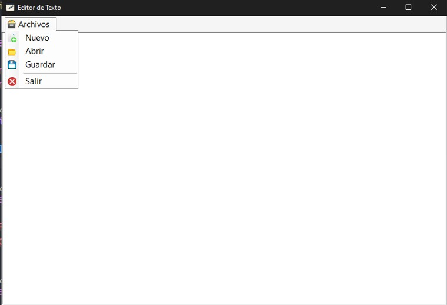

# Simple Editor Texto

## Descripció:

Editor de texto sencillo con las funcionalidades de nuevo, abrir, guardar y editar un archivo de texto con solo la extensión **.txt**

## Tecnologías usadas

Desarrollado en Windows Application y .NET 6.0

#### 👨‍💻 Luis Emilio Valenzuela
